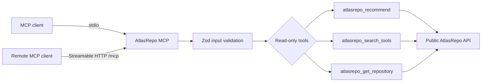

<div align="center">
  
  <h1>AtlasRepo MCP</h1>
  <p><strong>A public, read-only MCP connector for evidence-backed repository decisions.</strong></p>
  <p><code>POST /mcp</code> · <a href="https://mcp.atlasrepo.com/readyz">Readiness</a> · <a href="https://mcp.atlasrepo.com/livez">Liveness</a> · <a href="README.ru.md">Русский</a></p>
  <a href="https://github.com/Arnon-hs/atlasrepo-mcp/actions/workflows/ci.yml"></a>
  <a href="https://github.com/Arnon-hs/atlasrepo-mcp/actions/workflows/publish.yml"></a>
  <a href="https://www.npmjs.com/package/atlasrepo-mcp"></a>
</div>

## Purpose

AtlasRepo MCP adapts the public AtlasRepo catalog contract to Model Context Protocol clients. It supports local stdio and hosted Streamable HTTP, exposes three bounded read-only tools, and contains no private scoring, account or billing logic.

| Owns | Does not own |
| --- | --- |
| MCP protocol, schemas and tool descriptions | Catalog ingestion, scoring or moderation |
| Bounded API client, timeouts and result truncation | Authentication, accounts or payments |
| stdio executable and Streamable HTTP endpoint | Web/Admin UI or database access |
| Origin/host validation and health endpoints | Arbitrary URL fetching or code execution |

## Architecture



## Tools

| Tool | Input | Result |
| --- | --- | --- |
| `atlasrepo_recommend` | A bounded problem/use-case query | Evidence-backed repository recommendations |
| `atlasrepo_search_tools` | Search text and bounded filters | Matching tools from the approved catalog |
| `atlasrepo_get_repository` | Repository owner and name | One repository evidence record |

All inputs are schema-validated. Upstream calls have a timeout and responses are truncated to a safe maximum. The connector never executes discovered repositories.

## Technology

| Area | Choice |
| --- | --- |
| Language/runtime | TypeScript, Node.js 20+ |
| Protocol | Model Context Protocol SDK |
| HTTP | Express 5, Streamable HTTP |
| Validation | Zod 4 |
| Distribution | npm executable and Docker/Zeabur service |

## Install in one command

Install the AtlasRepo plugin for Codex with the same command shown in the AtlasRepo account:

```bash
codex plugin marketplace add Arnon-hs/atlasrepo-mcp && codex plugin add atlasrepo@atlasrepo
```

The plugin connects to the hosted Streamable HTTP service at `https://mcp.atlasrepo.com/mcp`. The public catalog tools are read-only; account quota and connected OAuth clients are shown in the AtlasRepo API connections panel.

## Local development

```bash
npm ci
npm run check
npm test
npm run build
npm run readiness:store
node dist/index.js
```

## HTTP service

```bash
PORT=8080 MCP_ALLOWED_HOSTS=localhost npm run start:http
```

| Variable | Purpose |
| --- | --- |
| `ATLASREPO_API_BASE_URL` | Upstream public API origin |
| `ATLASREPO_API_KEY` | Optional upstream key; keep secret |
| `ATLASREPO_REQUEST_TIMEOUT_MS` | Bounded upstream timeout |
| `PORT` | HTTP listener port |
| `MCP_ALLOWED_HOSTS` | Comma/space/semicolon-separated Host allowlist |

Use [.env.example](.env.example) as the non-secret template. Never remove immutable or inherited Zeabur variables.

## Verification, deployment and publishing

Every pull request runs secret-free hosted quality gates. After merge, the
trusted `main` workflow runs on one ephemeral JIT runner and performs:

1. **Build and test** - typecheck, tests, package smoke and dependency audit.
2. **Image verification** - build and inspect the production Docker image.

This repository does not deploy, migrate or probe production from its main
workflow. Production releases are owned by the pinned contract in
[`Arnon-hs/atlasrepo-schema/.github/workflows/release.yml`](https://github.com/Arnon-hs/atlasrepo-schema/blob/main/.github/workflows/release.yml),
which deploys services sequentially and verifies the release. npm publication
is separate: create a reviewed semantic-version tag and let the
trusted-publishing workflow publish the package.

## Engineering rules

- Preserve read-only behavior and bounded inputs, timeouts and result sizes.
- Keep stdout protocol-clean in stdio mode; diagnostics go to stderr without secrets.
- Never log API keys, authorization headers or full upstream payloads.
- Add schemas and tests with every tool/contract change.
- Conventional Commits: `feat(mcp): ...`, `fix(http): ...`, `docs(mcp): ...`.

## Pull request checklist

- [ ] `npm run check`, `npm test`, `npm run build` and `npm run smoke` pass.
- [ ] stdio stdout contains protocol messages only.
- [ ] HTTP host/origin protections and health contracts remain intact.
- [ ] No private Platform/Scout logic or write operation was added.
- [ ] The main JIT workflow built and inspected the MCP container image.
- [ ] Any production release was initiated only from the Schema release contract.

## License

MIT. See [LICENSE](LICENSE).
