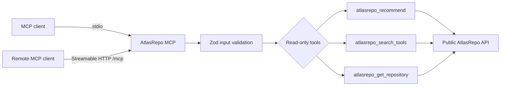

<div align="center">
  
  <h1>AtlasRepo MCP</h1>
  <p><strong>Публичный read-only MCP-коннектор для evidence-backed выбора репозиториев.</strong></p>
  <p><code>POST /mcp</code> · <a href="https://mcp.atlasrepo.com/readyz">Readiness</a> · <a href="https://mcp.atlasrepo.com/livez">Liveness</a> · <a href="README.md">English</a></p>
  <a href="https://github.com/Arnon-hs/atlasrepo-mcp/actions/workflows/ci.yml"></a>
  <a href="https://github.com/Arnon-hs/atlasrepo-mcp/actions/workflows/publish.yml"></a>
  <a href="https://www.npmjs.com/package/atlasrepo-mcp"></a>
</div>

## Назначение

AtlasRepo MCP адаптирует публичный контракт каталога к клиентам Model Context Protocol. Поддерживаются local stdio и hosted Streamable HTTP, три ограниченных read-only tool. Private scoring, accounts и billing здесь отсутствуют.

| Отвечает | Не отвечает |
| --- | --- |
| MCP protocol, schemas и tool descriptions | Ingestion, scoring и moderation каталога |
| Bounded API client, timeouts и result truncation | Auth, accounts и payments |
| stdio executable и Streamable HTTP endpoint | Web/Admin UI и доступ к БД |
| Origin/host validation и health endpoints | Arbitrary URL fetching и code execution |

## Архитектура



## Tools

| Tool | Input | Result |
| --- | --- | --- |
| `atlasrepo_recommend` | Ограниченный problem/use-case query | Evidence-backed repository recommendations |
| `atlasrepo_search_tools` | Search text и bounded filters | Tools из approved catalog |
| `atlasrepo_get_repository` | Repository owner и name | Одна evidence record репозитория |

Inputs проходят schema validation, upstream calls имеют timeout, responses ограничены по размеру. Найденные репозитории никогда не исполняются.

## Технологии

| Область | Выбор |
| --- | --- |
| Язык/runtime | TypeScript, Node.js 20+ |
| Protocol | Model Context Protocol SDK |
| HTTP | Express 5, Streamable HTTP |
| Validation | Zod 4 |
| Distribution | npm executable и Docker/Zeabur service |

## Установка одной командой

Установите AtlasRepo plugin для Codex той же командой, которая показана в кабинете AtlasRepo:

```bash
codex plugin marketplace add Arnon-hs/atlasrepo-mcp && codex plugin add atlasrepo@atlasrepo
```

Plugin подключается к hosted Streamable HTTP service `https://mcp.atlasrepo.com/mcp`. Публичные catalog tools работают только на чтение; квота аккаунта и подключённые OAuth-клиенты отображаются в разделе API connections кабинета AtlasRepo.

## Локальная разработка

```bash
npm ci
npm run check
npm test
npm run build
npm run readiness:store
node dist/index.js
```

## HTTP service

```bash
PORT=8080 MCP_ALLOWED_HOSTS=localhost npm run start:http
```

| Переменная | Назначение |
| --- | --- |
| `ATLASREPO_API_BASE_URL` | Origin upstream public API |
| `ATLASREPO_API_KEY` | Optional upstream key; хранить как secret |
| `ATLASREPO_REQUEST_TIMEOUT_MS` | Bounded upstream timeout |
| `PORT` | Порт HTTP listener |
| `MCP_ALLOWED_HOSTS` | Host allowlist через запятую/пробел/точку с запятой |

Используйте [.env.example](.env.example) как non-secret template. Никогда не удаляйте неизменяемые или унаследованные переменные Zeabur.

## Деплой и публикация

Каждый pull request проходит один пятистадийный release service:

1. **Build** — typecheck, tests, package smoke и Docker build.
2. **Deploy** — auto-merge после проверок; Zeabur видит один commit `main`.
3. **Migrations** — явный no-op: MCP не владеет DB schema.
4. **Tests** — `/livez`, `/readyz`, `/mcp` transport и read-only tool smoke.
5. **Cache cleanup** — целевая очистка build/package cache.

Не деплойте вручную тот же merged commit. npm publication выполняется отдельно: reviewed semantic-version tag запускает trusted-publishing workflow.

## Правила разработки

- Сохраняйте read-only behavior и bounds для inputs, timeouts и result sizes.
- В stdio mode stdout содержит только protocol messages; diagnostics идут в stderr без секретов.
- Не логируйте API keys, authorization headers и полные upstream payloads.
- Tool/contract change требует schemas и tests.
- Conventional Commits: `feat(mcp): ...`, `fix(http): ...`, `docs(mcp): ...`.

## Checklist pull request

- [ ] Проходят `npm run check`, `npm test`, `npm run build`, `npm run smoke`.
- [ ] stdio stdout содержит только protocol messages.
- [ ] HTTP host/origin protections и health contracts сохранены.
- [ ] Private Platform/Scout logic и write operations не добавлены.
- [ ] Один merge создал один MCP service deployment.

## Лицензия

MIT. См. [LICENSE](LICENSE).
